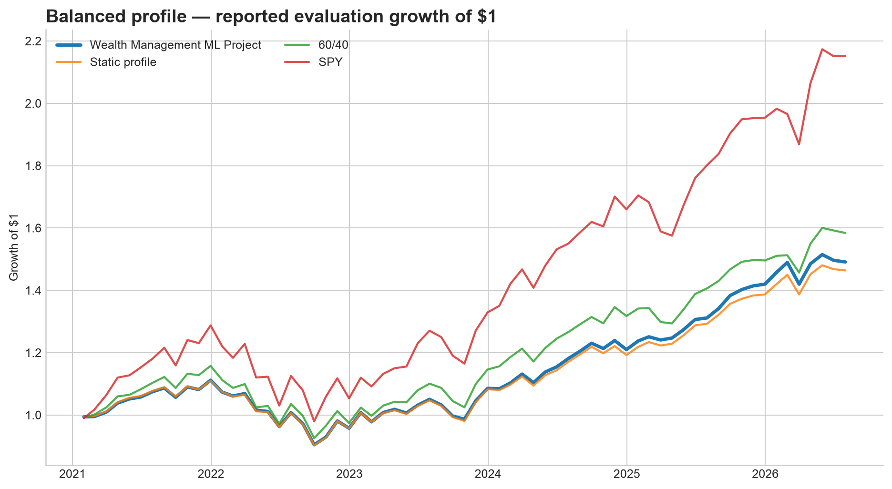

# Wealth Management Machine Learning Project
Ben ZeBrack

Instructions:
1. Go to repository folder.
2. Make sure all required downloads are installed (should be listed all in requirements.txt).
3. Run source .venv/bin/activate
4. Run python backtest.py
5. Run streamlit run app.py

This WM ML project is a suitability-aware model-portfolio recommender built with
PyTorch. It takes a supported investor profile plus information available at a
month-end, proposes a diversified ETF allocation, and explains which client
constraints drove the result.

The question I wanted to test was deliberately narrow:

> Can a small return model improve a portfolio at the margin without overriding
> a client's liquidity, risk, exclusion, and concentration constraints?



## What the results says

The research pipeline works, but the neural signal did **not** earn deployment.
On the reported January 2021–July 2026 evaluation for the balanced synthetic
profile, the combined signal slightly improved the profile-matched static
allocation. It did not beat 60/40 or SPY, and momentum alone did better than the
combined model. The PyTorch-only strategy also had more turnover while failing
to beat the static baseline.

That negative ML result is intentional to preserve. A validation-sensitive
wealth-management team should prefer an honest rejected model to a favorable
backtest created by tuning on the answer.

| Strategy | CAGR | Volatility | Sharpe vs BIL | Max drawdown | Annual turnover |
|---|---:|---:|---:|---:|---:|
| ML Project: 25% neural / 75% momentum | 7.4% | 9.3% | 0.49 | -18.6% | 39.6% |
| Momentum only | 7.5% | 9.4% | 0.50 | -18.7% | 41.7% |
| Neural only | 7.0% | 9.3% | 0.45 | -18.6% | 86.2% |
| Static profile | 7.1% | 9.3% | 0.45 | -18.7% | 22.3% |
| 60/40 | 8.6% | 10.8% | 0.54 | -20.1% | 17.3% |
| SPY (context only) | 14.7% | 15.2% | 0.78 | -23.9% | 0.0% |

These figures are generated by the experiment and saved in `results/`. SPY is
shown as market context, not as the appropriate primary benchmark for every
client. The primary comparison is the same client's static policy.

## File design

There are four application files:

```text
data.py       download/cache prices; validate data; build all features and labels
model.py      scale data; train/save the PyTorch MLP; generate walk-forward forecasts
backtest.py   profile rules; allocation; costs; metrics; benchmarks; experiment CLI
app.py        interactive Streamlit recommendation and results walkthrough
```

One test file and normal repository support files sit beside them:

```text
tests/test_project.py
README.md
requirements.txt
.gitignore
LICENSE
results/
```

The file structure is small enough to explain from beginning to end while
keeping the functionality and validation checks from the larger prototype.

## How it works

```text
completed month-end ETF prices
            |
            v
  lagged returns, risk, trend, drawdown and market-context features
            |
            v
 small PyTorch MLP -> next-month excess-return score over BIL
            |                     + transparent 9-month momentum score
            +---------------------+
                         |
                  bounded tactical tilt
                         |
client profile -> strategic policy -> hard suitability constraints
                         |
               allocation + explanation
                         |
       next-month walk-forward evaluation with costs
```

The universe is SPY, EFA, EEM, AGG, TIP, VNQ, GLD, and BIL. The first seven are
scored; BIL is the cash proxy. The 26 model inputs include 1/3/6/12-month asset
returns, trailing volatility, ten-month trend, drawdown, relative strength,
broad-equity context, and an asset indicator.

The network is intentionally small:

```text
26 inputs -> Linear(32) -> ReLU -> Dropout
          -> Linear(16) -> ReLU -> 1 forecast
```

It uses Huber loss, AdamW, chronological validation, early stopping, and a fixed
seed. A larger neural network would be hard to justify with monthly data.

The prediction never decides whether an allocation is suitable. A transparent
policy first calculates a strategic portfolio and then permits only bounded
within-sleeve tilts. It enforces long-only weights, no leverage, a liquidity
floor, a growth cap, exclusions, and a maximum non-cash position. It abstains
when a supported profile is infeasible or near-term cash needs dominate.

## Supported investor inputs

The app accepts any valid combination within this documented schema, not every
possible real-world household:

| Input | Role in the policy |
|---|---|
| investable assets | Converts dollar needs into portfolio percentages |
| horizon | Limits growth exposure when money is needed sooner |
| risk tolerance, 1–5 | Represents willingness to take market risk |
| maximum tolerable drawdown | Helps set a risk budget; it is not a loss guarantee |
| expenses, outside cash, 12-month liquidity | Establish a minimum BIL allocation |
| income stability | Sets a 6-, 9-, or 12-month reserve target |
| goal and monthly contribution | Estimates the return required to reach the goal |
| objective | Adjusts the strategic preservation/income/growth mix |
| exclusions and position cap | Enforces implementation constraints |

Age and income are retained as client context; horizon, liquidity, ability, and
willingness to bear loss drive the recommendation more directly.

## Run it

Python 3.11 or 3.12 is recommended.

```bash
python -m venv .venv
source .venv/bin/activate
pip install -r requirements.txt
python backtest.py
```

The first run downloads adjusted Yahoo Finance data, trains annual walk-forward
models, and writes the result CSVs and charts. Later runs reuse the local cache.
For a faster smoke run:

```bash
python backtest.py --quick
```

Launch the interface after generating results:

```bash
streamlit run app.py
```

Run the offline checks with:

```bash
pytest -q
```

## Why the backtest is credible

For a recommendation after month-end `t`:

1. Features use prices through `t` only.
2. Training includes a label only when its next-month return is already known by
   `t`.
3. Scaling and validation use only the relevant training history.
4. The allocation receives the first return strictly after the decision date.
5. Holdings drift with market returns, and trading is charged 10 basis points
   per dollar bought or sold using full-L1 turnover.
6. The model retrains on a fixed annual schedule rather than in response to
   evaluation performance.

The experiment reports the profile-matched static allocation, 60/40, SPY,
equal-risky, and BIL. It also saves neural-only, momentum-only, and no-signal
ablations plus forecast-error diagnostics.

## Data and license

Prices are downloaded at run time with `yfinance` for research and
cached locally; raw market data are excluded from Git. Code is available under
the MIT License. Market data remain subject to their provider's terms.
